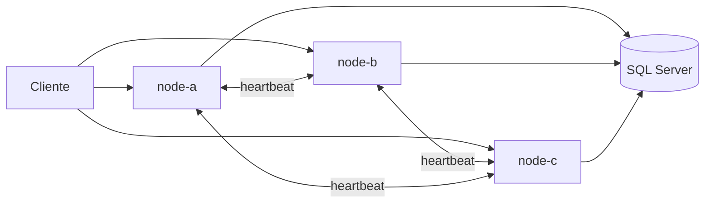

## Requisitos

- [.NET 8 SDK]
- [Docker Desktop]

## Inicio rápido

```bash
docker compose up --build
```

| Servicio | Puerto |
|----------|--------|
| node-a | 8081 |
| node-b | 8082 |
| node-c | 8083 |
| SQL Server | 1433 |

## Demo de failover

```powershell
.\scripts\demo-failover.ps1
```

Pipeline completo:

```powershell
.\scripts\pipeline.ps1
```

## API

Header requerido: `X-Api-Key: demo-api-key`

```bash
# Aceptar pago
curl -X POST http://localhost:8081/pay \
  -H "Content-Type: application/json" \
  -H "X-Api-Key: demo-api-key" \
  -H "Idempotency-Key: TX-99" \
  -d '{"amount": 250.00}'

# Consultar estado (cualquier nodo)
curl http://localhost:8082/pay/TX-99 -H "X-Api-Key: demo-api-key"
```

## Arquitectura



## Configuración regional (zona horaria compartida)

Todos los servicios (SQL Server + 3 nodos) comparten la misma configuración vía `x-regional-env` en `docker-compose.yml`:

| Variable | Valor por defecto | Propósito |
|----------|-------------------|-----------|
| `TZ` | `America/Bogota` | Zona horaria del contenedor |
| `Regional__Culture` | `es-CO` | Cultura .NET para formato |
| `Regional__UseUtcForPersistence` | `true` | Leases y timestamps en UTC en BD |

Verificar en cualquier nodo:

```bash
curl http://localhost:8081/health
```

Respuesta incluye `timeZoneId`, `utcNow` y `regionalNow` — deben ser iguales en los 3 nodos.

Para cambiar región, se puede editar `x-regional-env` una sola vez y reconstruye: `docker compose up --build`.

## Estructura

```text
MakerTest/
  SolidarityGrid.Api/           # Endpoints, middleware
  SolidarityGrid.Application/   # Use cases, contratos
  SolidarityGrid.Domain/        # Entidades
  SolidarityGrid.Infrastructure/ # SQL Server, mesh, background services
```

## Chaos manual

```bash
docker stop payment-node-a
docker compose logs -f node-b
```
